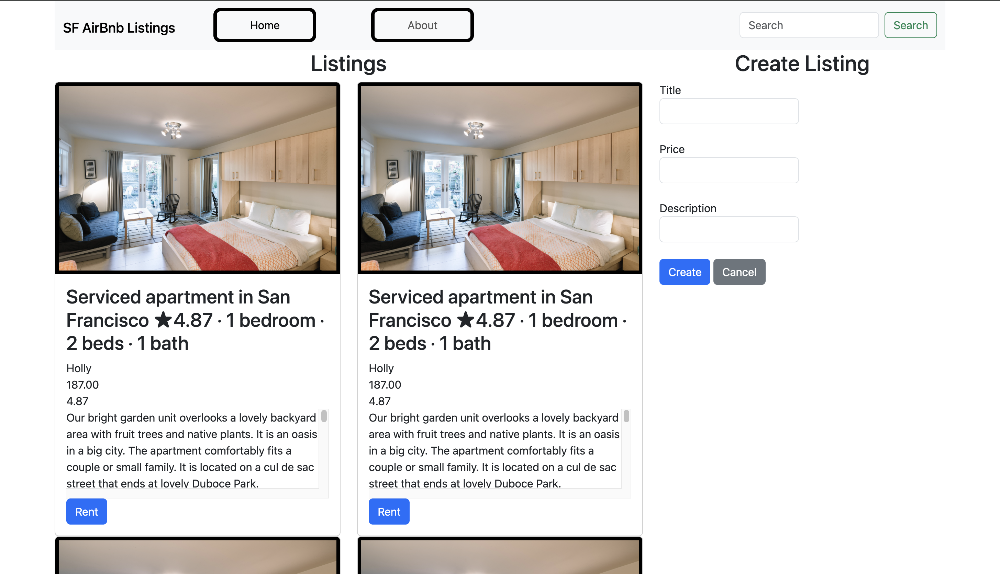

# Airbnb SF Listings

## Project Objective
This project is a practice exercise to enhance my skills in Bootstrap, JavaScript, HTML, and CSS. The goal is to understand how these components interact while working with real data from a JSON file. The project dynamically loads and displays the first 50 Airbnb listings from a JSON file using JavaScript fetch and async/await, and is styled using Bootstrap 5.

## Live Demo
[View Deployment](https://swbehan.github.io/airbnb_self_assesment_demo/)

## Screenshot


## Features
- Dynamically loads the first 50 listings from a JSON file using AJAX (fetch + async/await)
- Displays listing name, description, amenities, host name and photo, price, and thumbnail for each listing
- Star rating system built from scratch using emoji to visually represent each listing's review score
- Fallback images for listings or hosts with broken image URLs
- **Rent Modal** — clicking the Rent button on any listing opens a modal pre-populated with the host's name and listing price. The form collects guest name, email, number of guests, and number of nights, and automatically calculates the total cost based on the nightly price. Submitting the form shows a booking confirmation.

## Tech Requirements
- **HTML5** — for structuring the content
- **CSS3** — for styling the webpage
- **Bootstrap 5** — for responsive design and pre-built components
- **JavaScript (ES6)** — for dynamic content rendering and interactivity
- **JSON** — for loading and displaying real listing data

## How to Install/Use
1. Clone the repository:
```bash
   git clone https://github.com/swbehan/airbnb-listings-practice.git
```
2. Navigate to the project:
```bash
   cd airbnb-listings-practice
```
3. Open `index.html` in your browser or use a local server like VS Code Live Server

## Author
Created by [Sean Behan](https://github.com/swbehan)

## Reference
This project was created as part of the **Web Development Summer 2026** class. Learn more about the class [here](https://johnguerra.co/classes/webDevelopment_online_summer_2026/).

## AI Usage
This README was generated using GitHub Copilot and ChatGPT 5.5. Here is the prompt: 
``` Generate a good readme for this airbnb listing. This is basically just an attempt for me to practice bootstrap, javascript, html and css while using real data from a json file. Goal is to learn how those components interact. Good README Good project name Project objective Screenshot (gifs are preferred) Tech requirements How to install/use Author with link to homepage Reference to the class with link Link to the video demonstration Use Github Markdown```
